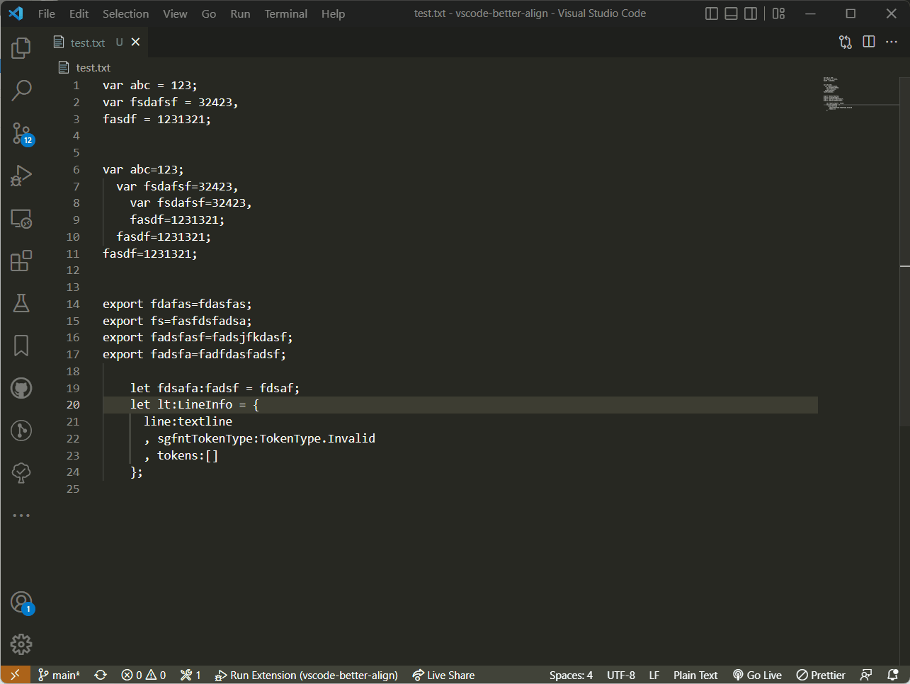

# Better Align for Visual Studio Code

[](https://badgen.net/gitlab/license/gitlab-org/omnibus-gitlab)
[](https://github.com/chouzz/vscode-better-align/releases)
[](https://marketplace.visualstudio.com/items?itemName=Chouzz.vscode-better-align)
[](https://github.com/chouzz/vscode-better-align/actions/workflows/CI.yaml/badge.svg)

Better vertical alignment with/without selection in any language for any characters or words.

## Features

- Allow align code in any language
- Align code by any characters(Default`:`,`=`,`+=`,`-=`,`*=`,`/=`,`=>`)
- Smart align with or without selection
- Auto align after you type words

## Usage

Place your cursor at where you want your code to be aligned, and use shortcut `alt + A` or invoke the `Align` command via Command Palette.

## Screenshots



## Extension Configuration

### `alignment.surroundSpace`

Default value:

```
alignment.surroundSpace : {
  "colon"      : [0, 1], // The first number specify how much space to add to the left, can be negative.
                         // The second number is how much space to the right, can be negative.
  "assignment" : [1, 1], // The same as above.
  "arrow"      : [1, 1], // The same as above.
  "comment"    : 2       // Special how much space to add between the trailing comment and the code.
                         // If this value is negative, it means don't align the trailing comment.
}
```

```
// Orignal code
var abc = {
  hello:      1
  ,my :2//comment
  ,friend:   3      // comment
}

// "colon": [0, 1]
// "comment": 2
var abc = {
    hello : 1
  , my    : 2  // comment
  , friend: 3  // comment
}

// "colon": [1, 2]
// "comment": 4
var abc = {
    hello  :  1
  , my     :  2    // comment
  , friend :  3    // comment
}

// "colon": [-1, 3]
// "comment": 2
var abc = {
    hello:    1
  , my:       2  // comment
  , friend:   3  // comment
}

// "colon": [-1, -1]
// "comment": 2
var abc = {
     hello:1
  ,     my:2  //comment
  , friend:3  // comment
}


// Orignal code
$data = array(
    'text' => 'something',
    'here is another' => 'sample'
);

// "arrow": [1, 3]
$data = array(
    'text'            =>   'something',
    'here is another' =>   'sample'
);

```

## Issues/Contribution

If you've found a bug, please file at <https://github.com/chouzz/vscode-innosetup/issues>.

If you'd like to help out, fork the [repo](https://github.com/chouzz/vscode-innosetup) and submit pull requests.

## License

This work is licensed under [Apache License 2.0](https://opensource.org/licenses/Apache-2.0)
